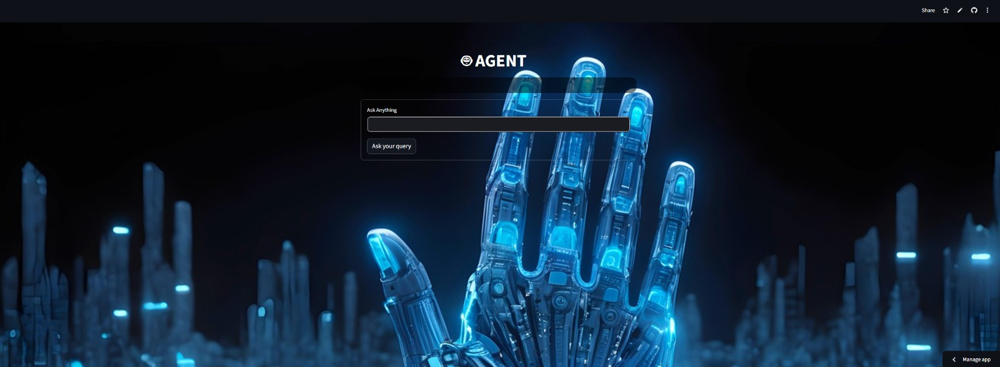

# 🤖 AI Chatbot Application


---

## 🌐 Live Demo

https://chatbot-darsmdwajymureow4iqs3s.streamlit.app/

---

## 🚀 Overview

This project is an **AI-powered chatbot** built using Python and NLP techniques.
It processes user input and generates context-aware responses through predefined logic and/or AI services.

The application is deployed using **Streamlit**, allowing real-time interaction via a web interface.

---

## 🧠 Features

* Interactive chatbot interface
* Natural language input handling
* Context-based response generation
* Clean and responsive UI
* Real-time interaction via web app

---

## 🖥️ UI Preview



---

## 🛠️ Tech Stack

* **Language:** Python
* **Frontend:** Streamlit
* **Concepts:** NLP, Conversational AI
* **Tools:** Git, GitHub

---

## 📁 Project Structure

```bash
chat-bot/
│
├── app.py
├── chatbot.py
├── requirements.txt
├── ui_screenshot.png
└── README.md
```

---

## ▶️ How to Run

### 1. Install dependencies

```bash
pip install -r requirements.txt
```

### 2. Run the app

```bash
streamlit run app.py
```

---

## 🎯 Key Learnings

* Building conversational AI systems
* Handling user input and response flow
* Designing interactive UI with Streamlit
* Deploying ML/AI applications

---

## 📌 Future Improvements

* Integrate advanced NLP models (GPT / LLM APIs)
* Add conversation memory
* Improve UI/UX with better styling

---

## 👨‍💻 Author

**Harsh Vardhan Kushwaha**

* LinkedIn: https://linkedin.com/in/harsh-vardhan-kushwaha-ba0a53282
* GitHub: https://github.com/vk-harsh

---

⭐ If you found this project useful, feel free to star the repository!
